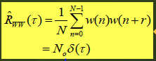

# 인터넷 프로토콜
## 인터넷 5계층
|계층|역할|
|-----|-----|
|물리 계층(physical layer)|디지털 통신시스템 유선, 무선 전송매체|
|데이터링크 계층(datalink layer)|오류제어(ECC), 매체 접근 제어(MAC)|
|네트워크 계층(network layer)|라우팅 프로토콜, IPv4, IPv6,ARP, DHCP, ICMP, IGMP, Mobile IP|
|전송 계층(transport layer)|UDP(실시간 전공 -> 오류 무시), TCP, Socket Error Control, Congestion Control|
|응용 계층(application layer)|HTTP, SMTP, FTP|

- 표현 계층, 세션 계층이 없다.

## 물리 계층(디지털 통신시스템)
### 디지털 통신시스템과 물리 계층
- 구성 : 전송단, 전송매체(채널), 수신단
- 
### 디지털 통신시스템 구성
- 정보원(information source) : 음성, 오디오, 영상, 데이터 -> 멀티미디어
- 전송기(Tx, Transmitter) : 정보를 전송매체에 적합한 전송신호로 변환
- 전송매체(채널, channel) : 구리선, 광섬유 등의 유선과 무선 전송매체
- 수신기(Rx, Receiver) : 전송매체로부터 수신한 신호에서 정보원을 복원
- 
### 전송매체(transmission media)
#### 유선 전송매체(wired transmission media)
- 꼬임상선 케이블(twisted pair cable), 동축 케이블(coaxial cable), 전력선(power line), 광섬유(optical fiber)등으로 구분
- 꼬임상선 케이블은 비차폐 꼬임상선(UTP, Unshielded Twisted Pair)과 차폐 꼬임상선(STP, Shielded Twisted Pair) 케이블로 구분4
- 선로의 굵기에 따라 대역폭이 결정되고 채널로 전송가능한 최대 전송속도가 결정됨
- 전송장애(transmission impairments) : 전송신호의 감쇠(attenuation), 왜곡(distortion), 잡음(noise)
#### 무선 전송매체(wireless transmission media)
- 대역에 따라 라디오파, 마이크로파, 밀리미터파, 적외선 등으로 구분
- LED를 이용한 라이파이 통신시스템 또한 존재
- 인체를 전송매체로 한 WBAN(Wireless Body Area Network) 통신시스템 존재
- 데이터 전송을 위해 사용하는 <b>반송 주파수(carrier frequency)와 대역폭(bandwidth)</b>으로 나타냄
- 반송주파수 대역에 따라 구분

### AWGN 신호
#### 열잡음
- 존슨 잡음, 나이퀴스트 잡음이라고도 불림
- 조체에서 자유전자의 열 진동에 의해 발생하는 신호로 온도에 비례하여 증가
- 절대 온도 0°K(섭씨 -273°C)가 아니면 시스템에 존재하는 신호
- 수신신호에 포함된 잡음신호를 제거할수 없다.
#### 잡음신호의 원인
- 수신기, 전송 선로 혹은 전파 매체 내에서 열 교란에 의해 발생
- 열 에너지에 의해 발생하므로 온도가 높을수록 잡음신호가 커짐
- 저항기에서 많이 발생하여 기기 내부 잡음의 주요한 원인

#### AWGN 채널 모델
- 가우션 확률밀도함수(Gaussian pdf) : 잡음 신호의 분포가 Gaussian pdf(Normal pdf)를 따른다.
- 백색 잡음(White Noise) : 잡음 신호의 전력밀도 스펙트럼이 하얀색과 같이 전 주파수 성분을 갖는다.
- 가산 잡음(Additive Noise) : 전송 신호에 잡음 신호는 더해져 수신된다.

#### 가우션 잡음(Guassian Noise)
- 가우션 잡음 : 잡음신호의 히스토그램을 확률로 모델링
- 가우션 확률밀도함수
- 
- 
>- 잡음신호의 평균값 : 0
>- 분산(평균 전력) : N0[watt/Hz]

#### 백색 잡음(White Noise)
- 백색 잡음 : 잡음신호의 전력 스펙트럼(power spectrum)
- 백색 잡음의 자기 상관함수(현재 잡음 * 그 잡음에서 t만큼 떨어져 있는 위치의 잡음) : 

#### 가산 잡음(Additive Noise)
- AWGN 채널로부터 수신신호 : r(t) = s(t) + w(t) -> 수신신호 = 보내는 신호 + 잡음
- 신호-대-잡음 비(SNR, Signal-to-noise Ratio) : SNR = 전송신호의 평균전력/잡음신호의 평균전력

#### 이동 채널 모델
##### 무선망 설계
- 기지국의 위치와 서비스 반경 결정
- Long-term : 평균전력(오랜기간 데이터 수집후 평균을 구해야함), 통신 가능한 수신 전력
- 경로 손실 모델(전파전파 모델, wave propagation model)

##### 디지털 통신시스템 설계
- 주어진 SNR에서 QoS를 만족하면서 최대 전송속도를 갖는 통신시스템 개발
- Short-term : 심볼구간(Symbol interval) 이동채널이 심볼이 미치는 영향
- 다중 경로 레일레이 페이딩 모델

##### 이동 채널 모델 정리
- 기지국과 사용자 단말 사이의 채널 모델
1. 경로 손실(path loss, long-term average power)
2. shadowing -> 전파를 보내는데 중간의 방해박(나무, 눈 등)으로 인한 전파 손실
>- link-budget : 기지국의 서비스 반경을 결정
3. 페이딩(fading, short-term variation) : 이동통신시스템 통신방식의 BER 성능을 결정